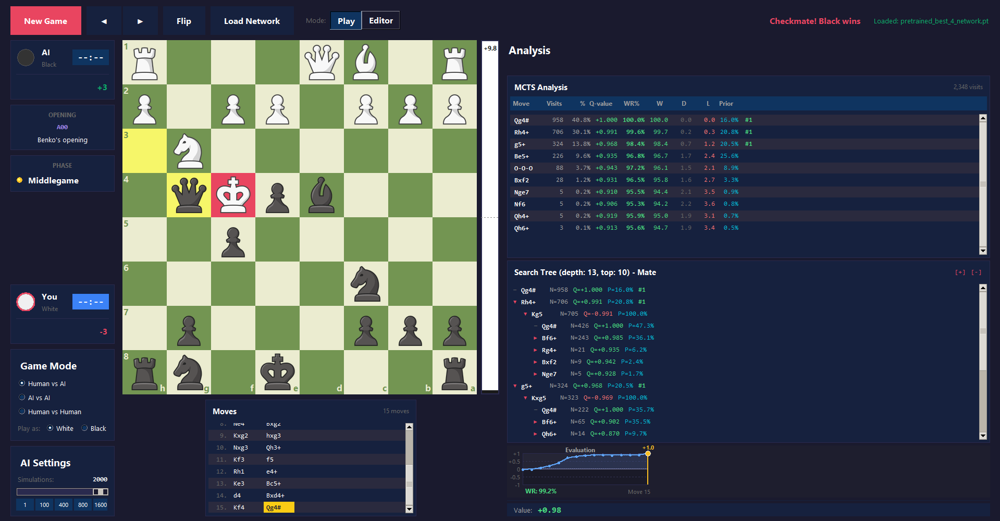
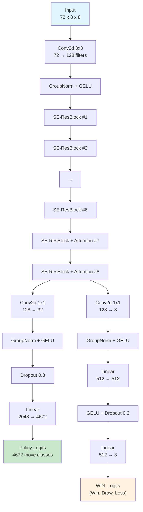
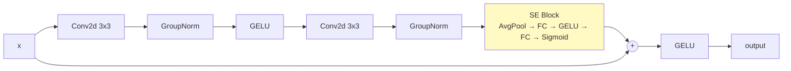
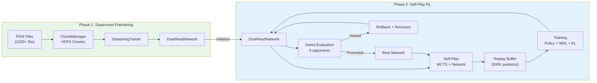
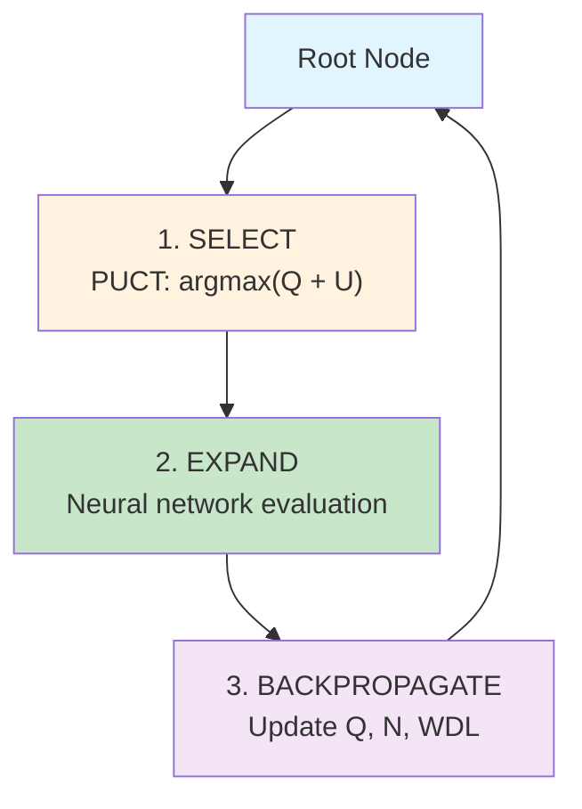
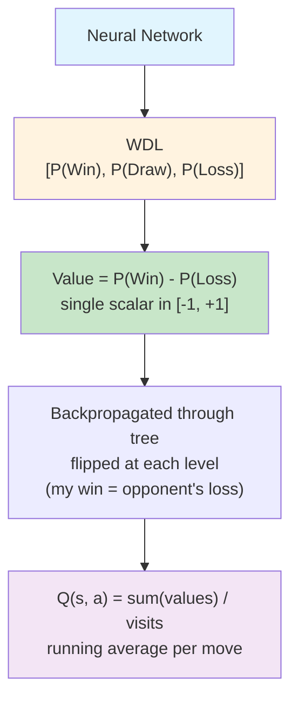
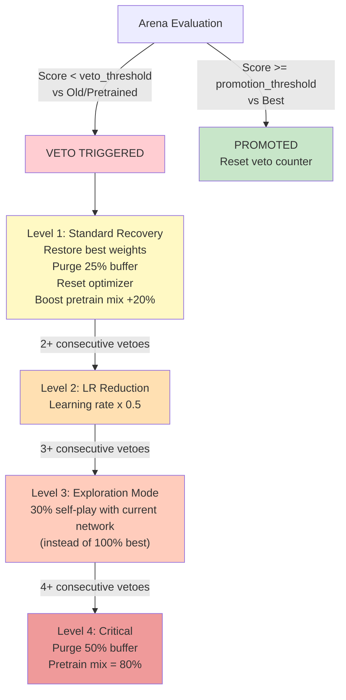

<div align="center">

# NeuralMatePlay

**A Two-Phase Reinforcement Learning Chess Engine**

[](https://python.org)
[](https://pytorch.org)
[](LICENSE)
[](https://github.com/psf/black)

**[:fr: Version française disponible ici](README_FRENCH.md)**

_Combining supervised pretraining on master-level games with AlphaZero-style self-play reinforcement learning, using a SE-ResNet architecture with spatial attention and Win/Draw/Loss value estimation._

**How it works in a nutshell**: The engine first learns chess by studying thousands of games played by strong human players (pretraining), then improves further by playing millions of games against itself (self-play). A neural network evaluates board positions and a tree search algorithm explores possible moves to find the best one.

</div>

<div align="center">



*Game UI showing a checkmate delivered by the AI (Black) with Qg4#, with MCTS analysis, search tree, evaluation graph and move history.*

</div>

---

## Abstract

> NeuralMatePlay is a chess engine built on a **two-phase training paradigm**: (1) **supervised pretraining** on master-level games -- the neural network learns to imitate strong human players by predicting their moves and game outcomes -- and (2) **AlphaZero-style self-play reinforcement learning** -- the engine then plays against itself to discover strategies that go beyond human knowledge. The architecture employs a **Squeeze-and-Excitation ResNet** (a deep neural network where each layer can learn to focus on the most important features), enhanced with **multi-head spatial attention** (allowing the network to "look at" distant parts of the board simultaneously, such as a bishop threatening a rook across the board). The network outputs both a **policy** (a probability distribution over 4,672 possible moves, telling the engine which moves look promising) and a **Win/Draw/Loss (WDL) triplet** (three probabilities estimating the chances of winning, drawing or losing the current position). A multi-level **anti-forgetting system** with veto escalation ensures the engine never "forgets" what it learned during pretraining as it trains further. Board positions are encoded as **72-plane tensors** -- think of it as 72 layered 8x8 grids, each capturing different information about the position: piece locations, move history, attack patterns and tactical features.

### Key Features

- **SE-ResNet + Spatial Attention** -- a deep neural network backbone that learns which features matter most (SE) and how different squares on the board relate to each other (attention), using Group Normalization and GELU activations for stable, smooth training
- **WDL value head** -- instead of a single "how good is this position?" score, the network predicts three separate probabilities: Win, Draw and Loss, giving it a much better understanding of drawn positions (+100-150 Elo improvement)
- **72-plane board encoding** -- the board is represented as 72 layered grids, including 4 positions of history (so the network can see recent moves), NNUE-inspired semantic features (king safety, pawn structure) and tactical planes (pins, hanging pieces)
- **Batched MCTS** -- Monte Carlo Tree Search, a look-ahead algorithm that simulates hundreds of possible game continuations to find the best move, optimized with virtual losses (for parallelism), transposition tables (avoiding redundant work) and tree reuse (keeping analysis between moves)
- **4-level veto escalation** -- a progressive safety system that detects and recovers from catastrophic forgetting (when the network suddenly "forgets" what it learned and starts playing worse)
- **Adaptive KL divergence** regularization -- a mathematical constraint that prevents the network from drifting too far from its pretrained knowledge, acting as a "soft wall" that gets stronger the more the network tries to deviate
- **Mixed precision (FP16)** -- uses half-precision floating point numbers on GPU for ~2x faster training and inference with minimal accuracy loss
- **Streaming HDF5** chunk-based pretraining -- processes large PGN game databases (potentially millions of games) in small memory-efficient chunks rather than loading everything into RAM at once
- **5-opponent arena** -- after every few training cycles, the engine is tested against 5 different opponents (from random play to its own previous best version) to ensure it's actually improving, with ELO rating tracking

---

## Table of Contents

- [Architecture](#architecture)
  - [Network Overview](#network-overview)
  - [SE-ResBlock](#se-resblock)
  - [Spatial Attention](#spatial-attention)
  - [WDL Head vs Scalar Value](#wdl-head-vs-scalar-value)
- [Board Encoding (72 Planes)](#board-encoding-72-planes)
- [Move Encoding (4,672 Classes)](#move-encoding-4672-classes)
- [Training Pipeline](#training-pipeline)
  - [Phase 1: Supervised Pretraining](#phase-1-supervised-pretraining)
  - [Phase 2: Self-Play RL](#phase-2-self-play-rl)
  - [Loss Functions](#loss-functions)
- [Monte Carlo Tree Search](#monte-carlo-tree-search)
  - [PUCT Selection](#puct-selection)
  - [Q-Value](#q-value)
  - [MCTS Features](#mcts-features)
  - [WDL-Aware Enhancements](#wdl-aware-enhancements)
- [Anti-Forgetting System](#anti-forgetting-system)
  - [Veto Escalation](#veto-escalation)
  - [Mechanisms](#mechanisms)
- [Arena Evaluation](#arena-evaluation)
- [Graphical User Interface](#graphical-user-interface)
  - [Game UI](#game-ui)
  - [Training Monitor](#training-monitor)
  - [Match Viewer](#match-viewer)
- [Getting Started](#getting-started)
  - [Prerequisites](#prerequisites)
  - [Download Pretrained Model](#download-pretrained-model)
  - [Installation](#installation)
  - [Quick Start](#quick-start)
- [Configuration](#configuration)
- [Project Structure](#project-structure)
- [Citation](#citation)
- [Acknowledgments](#acknowledgments)

---

## Architecture

### Network Overview

The neural network is the "brain" of the chess engine. Given any chess position, it produces two outputs: (1) a **policy** -- a ranking of all possible moves from best to worst and (2) a **WDL evaluation** -- how likely the position leads to a win, draw or loss.

The `DualHeadNetwork` uses a **SE-ResNet backbone** (a stack of processing layers that progressively extract higher-level chess patterns, from basic piece detection up to complex strategic concepts) with **spatial attention** in the final blocks (allowing the network to relate distant squares, e.g: understanding that a bishop on b2 threatens a rook on g7). The network splits into two "heads" at the end: one for move selection (policy) and one for position evaluation (WDL).



| Parameter          | Value                             |
| ------------------ | --------------------------------- |
| Input planes       | 72                                |
| Backbone filters   | 128                               |
| Residual blocks    | 8 (6 plain SE + 2 with attention) |
| SE reduction ratio | 8                                 |
| Attention heads    | 4                                 |
| Policy output      | 4,672 classes                     |
| WDL output         | 3 (Win, Draw, Loss)               |
| Normalization      | GroupNorm (8 groups)              |
| Activation         | GELU                              |
| Parameters         | ~3.5M                             |

### SE-ResBlock

Each layer of the network is a **Squeeze-and-Excitation Residual Block** (SE-ResBlock). The "residual" part means each block adds its output to its input (a shortcut connection that makes deep networks easier to train). The "SE" part lets each block dynamically decide which features are most important for the current position -- for example, in an endgame, king activity features might be amplified while opening-specific features are suppressed:



The SE block performs **channel-wise attention** (each "channel" represents a different learned feature, like "pawn structure" or "king safety"):

1. **Squeeze**: Summarize each feature into a single number by averaging across all 64 squares
2. **Excite**: Pass through two small layers that output an importance score (0 to 1) for each feature
3. **Scale**: Multiply each feature by its importance score -- useful features get amplified, irrelevant ones get suppressed

### Spatial Attention

The last 2 residual blocks add **multi-head spatial self-attention** (4 heads). While convolutions only look at neighboring squares (a 3x3 window), attention allows every square to directly "communicate" with every other square on the board. This is critical for understanding long-range patterns like pin lines, battery alignments (rook behind queen) or a bishop's diagonal influence across the entire board.

The mechanism works in 3 steps:

- **Query/Key/Value projection**: Each square generates three vectors -- a Query ("what am I looking for?"), a Key ("what do I contain?") and a Value ("what information do I carry?")
- **Attention scores**: Each square's Query is compared to all other squares' Keys to determine which squares are most relevant (e.g: a king square attending to squares that attack it)
- **Aggregation**: Information from relevant squares is combined, weighted by the attention scores and added back to the original features via a residual connection

### WDL Head vs Scalar Value

Most chess engines use a single number to evaluate a position (e.g: +0.5 means "slightly better for White"). NeuralMatePlay instead predicts three probabilities: **Win, Draw and Loss**. This is especially important in chess where many positions are drawn -- a scalar value of 0.0 could mean either "perfectly balanced, likely draw" or "wild position, could go either way", but WDL distinguishes these cases clearly.

| Property      | WDL Head                    | Scalar Value Head        |
| ------------- | --------------------------- | ------------------------ |
| Output        | P(Win), P(Draw), P(Loss)    | Single value in [-1, 1]  |
| Loss function | Cross-entropy (3 classes)   | MSE                      |
| Draw handling | Explicit draw probability   | Draws collapse to 0      |
| Calibration   | Well-calibrated per outcome | Poor for drawn positions |
| MCTS value    | `V = P(Win) - P(Loss)`      | Direct output            |
| Strength gain | +100-150 Elo                | Baseline                 |

---

## Board Encoding (72 Planes)

Before the neural network can analyze a chess position, the board must be converted into numbers -- the network cannot "see" pieces directly. The encoding works like stacking 72 transparent 8x8 grids on top of each other. Each grid (called a **plane**) contains 1s and 0s representing a specific piece of information: "is there a white pawn on this square?", "is this square attacked?", "is this piece pinned?", etc.

Each position is encoded as a **tensor** (a multi-dimensional array) of shape `(72, 8, 8)` -- 72 planes of 8x8 grids -- from the perspective of the player to move (the board is flipped for Black, so the network always "sees" itself playing from the bottom).

**Formula**: `(H + 1) x 12 + 12 + 8 + 4 = 72` where `H = 3` (history length)

| Planes | Category              | Description                                  |
| ------ | --------------------- | -------------------------------------------- |
| 0-11   | Piece positions (T)   | Current position: 6 piece types x 2 colors   |
| 12-23  | Piece positions (T-1) | One move ago                                 |
| 24-35  | Piece positions (T-2) | Two moves ago                                |
| 36-47  | Piece positions (T-3) | Three moves ago                              |
| 48     | Metadata              | Side to move (constant 1.0 from perspective) |
| 49     | Metadata              | Full move count (normalized /200)            |
| 50-53  | Metadata              | Castling rights (my K, my Q, opp K, opp Q)   |
| 54     | Metadata              | En passant square                            |
| 55     | Metadata              | Halfmove clock (normalized /100)             |
| 56     | Metadata              | Repetition count (0.5 if 1x, 1.0 if 2x+)     |
| 57     | Metadata              | Is in check                                  |
| 58     | Metadata              | My attack map                                |
| 59     | Metadata              | Opponent attack map                          |
| 60     | Semantic (NNUE)       | King attackers                               |
| 61     | Semantic (NNUE)       | King defenders                               |
| 62     | Semantic (NNUE)       | Knight mobility                              |
| 63     | Semantic (NNUE)       | Bishop mobility                              |
| 64     | Semantic (NNUE)       | Passed pawns                                 |
| 65     | Semantic (NNUE)       | Isolated pawns                               |
| 66     | Semantic (NNUE)       | Weak squares                                 |
| 67     | Semantic (NNUE)       | Center control                               |
| 68     | Tactical              | Pinned pieces                                |
| 69     | Tactical              | Hanging pieces (undefended + attacked)       |
| 70     | Tactical              | Attacking pieces (targeting higher-value)    |
| 71     | Tactical              | Trapped pieces (mobility < 2)                |

---

## Move Encoding (4,672 Classes)

The network's policy head outputs a probability for every possible move. Since chess has a variable number of legal moves per position (typically 30-40, but the encoding must cover all possibilities), moves are encoded using a fixed-size **from-square-centric scheme**: for each of the 64 squares, we define 73 possible "move types" (directions and distances a piece could move from that square).

**Formula**: `64 squares x 73 move types = 4,672`

| Move Type        | Count  | Description                                                                                 |
| ---------------- | ------ | ------------------------------------------------------------------------------------------- |
| Queen-like moves | 56     | 8 directions x 7 distances (covers rook, bishop, queen, pawn, king moves)                   |
| Knight moves     | 8      | All 8 L-shaped moves                                                                        |
| Underpromotions  | 9      | 3 piece types (knight, bishop, rook) x 3 directions (left capture, straight, right capture) |
| **Total**        | **73** | Per from-square                                                                             |

Queen promotions are encoded as regular queen-direction moves. The encoding is symmetric: for Black, moves are vertically mirrored before encoding.

---

## Training Pipeline

Training happens in two phases. In **Phase 1**, the network learns from human expert games -- like a student studying grandmaster games to understand chess principles. In **Phase 2**, the network plays against itself (self-play) and learns from its own experience -- like a player who, after studying theory, improves by playing thousands of practice games and analyzing where it went wrong.



### Phase 1: Supervised Pretraining

In this phase, the network learns by imitation: given a position from a strong game, it tries to predict the move the expert played and the game's final outcome. Over millions of examples, the network learns piece values, common tactical patterns and positional concepts.

- Processes **PGN files** (the standard format for recorded chess games) from games rated **2200+ Elo** (expert-level and above)
- Streams positions through **HDF5 chunks** for memory efficiency -- the dataset can contain millions of positions, far too many to fit in RAM, so they are processed in small batches from disk
- Trains on **policy** (predicting the expert's move) and **WDL** (predicting who won the game) heads simultaneously
- Features a **tactical replay buffer** that replays difficult positions (captures, checks, promotions) more often, so the network spends more time learning from complex situations
- Supports **knowledge distillation** from a teacher model -- a larger, stronger network can guide the training of a smaller one

### Phase 2: Self-Play RL

In this phase, the engine plays against itself to discover new strategies. Each game generates training data: for every position, the engine records which moves it explored and who eventually won. The network then trains on this data to improve its move predictions and position evaluations.

- Generates games via **MCTS-guided self-play** (800 simulations per move by default -- the engine considers 800 possible future game continuations before choosing each move)
- **Temperature-based move selection**: early in the game (`T=1.0` for first 30 moves), the engine deliberately varies its play to explore different positions; later (`T=0.1`), it plays its best moves
- Trains on **mixed data**: self-play buffer + pretrained data (configurable ratio) -- mixing in expert games prevents the network from "forgetting" human chess knowledge
- **Arena evaluation** every 5 iterations against 5 opponent types -- regular testing to ensure the engine is actually getting stronger
- **Best model promotion** with anti-forgetting veto system -- only replaces the "best known version" if the new version proves stronger, with safeguards against regression

### Loss Functions

The **loss function** measures how wrong the network's predictions are -- the lower the loss, the better the network is performing. Training works by iteratively adjusting the network's weights to minimize this loss. The total training loss combines three components:

```
L = L_policy + L_WDL + w_KL * L_KL
```

| Component  | Formula                              | Description                                                                              |
| ---------- | ------------------------------------ | ---------------------------------------------------------------------------------------- |
| `L_policy` | `CrossEntropy(pi_pred, pi_target)`   | How far the predicted move probabilities are from the target moves                       |
| `L_WDL`    | `CrossEntropy(wdl_pred, wdl_target)` | How far the predicted Win/Draw/Loss probabilities are from the actual game outcome       |
| `L_KL`     | `KL(pi_current ‖ pi_pretrained)`     | How much the current policy has drifted from the pretrained policy (prevents forgetting) |

The **KL weight** `w_KL` is adaptive: when the network's behavior is still close to the pretrained model (KL divergence below target), the penalty stays light. But if the network starts deviating too much, the penalty increases progressively -- like an elastic band that pulls harder the more you stretch it:

```
w_KL = base                           if KL <= target
w_KL = base * (1 + factor * excess)   if KL > target   (capped at max)
```

Training uses mixed precision (FP16) on compatible GPUs with `torch.amp.autocast`.

---

## Monte Carlo Tree Search

**Monte Carlo Tree Search (MCTS)** is the "thinking" algorithm of the engine. Instead of evaluating every possible move to a fixed depth (like traditional engines), MCTS builds a **search tree** by selectively exploring the most promising moves. It runs hundreds of simulations: each simulation traverses the tree, reaches an unexplored position, asks the neural network to evaluate it and propagates the result back up. After all simulations, the move that was explored the most is selected as the best move.

### PUCT Selection

At each node in the tree, MCTS must decide which move to explore next. It uses the **PUCT formula** (Polynomial Upper Confidence Trees), which balances two goals: **exploitation** (exploring moves the network thinks are good) and **exploration** (trying less-visited moves that might be surprisingly strong):



**Selection formula:**

```
score(s, a) = Q(s, a) + U(s, a)

U(s, a) = c_puct * P(s, a) * sqrt(N(s)) / (1 + N(s, a))

select = argmax_a [ Q(s, a) + U(s, a) ]
```

Where:

- `Q(s, a)` = mean value from backpropagation -- the average evaluation of all simulations that went through this move (how good the move seems based on what we've explored so far)
- `P(s, a)` = prior probability from the policy network -- the network's initial guess of how good this move is, before any search
- `N(s)` = parent visit count -- total simulations run from the current position
- `N(s, a)` = child visit count -- how many times this specific move has been explored
- `c_puct = 1.5` = exploration constant -- higher values make the engine explore more broadly; lower values make it focus on the best-looking moves

### Q-Value

The **Q-value** (Quality value) is the central metric used by MCTS to evaluate how good a move is. It represents the **average evaluation** of all simulations that passed through a given move -- essentially, "based on everything we've explored so far, how promising does this move look?"

**How Q-value is computed:**

1. When the neural network evaluates a position, it outputs WDL probabilities: `[P(Win), P(Draw), P(Loss)]`
2. These are converted into a single scalar value: `V = P(Win) - P(Loss)`, ranging from -1 (certain loss) to +1 (certain win). A value of 0 means the position is balanced (either likely drawn or equally volatile)
3. As MCTS runs simulations, each node accumulates the values from all simulations that passed through it
4. The Q-value is the **running average**: `Q(s, a) = W(s, a) / N(s, a)` where `W` is the sum of all backpropagated values and `N` is the visit count



**Why Q-value matters:** In the PUCT formula, Q-value is the **exploitation** term -- it pulls the search toward moves that have historically led to good outcomes. A move with Q = +0.3 has led to favorable positions on average, while Q = -0.2 suggests the move tends to lead to trouble. The UI displays Q-values for each candidate move, color-coded green (positive, good for the engine) or red (negative, bad for the engine).

**Sign convention:** Because MCTS alternates between players at each tree level, the value is **negated** at each backpropagation step -- a position that is good for White (V = +0.5) is bad for Black (V = -0.5). This ensures Q-values are always from the perspective of the player making the move.

### MCTS Features

| Feature                   | Description                                                                                                                                                                      |
| ------------------------- | -------------------------------------------------------------------------------------------------------------------------------------------------------------------------------- |
| **Batched inference**     | Collects multiple leaf positions per iteration and evaluates them together on the GPU in a single batch, rather than one at a time (much faster)                                 |
| **Virtual losses**        | When exploring one path, temporarily marks it as "losing" so that parallel searches explore different paths, ensuring broad coverage                                             |
| **Transposition table**   | If the same position can be reached by different move orders (e.g: 1.e4 d5 vs 1.d4 e5 2.e4 d5), the engine reuses the existing analysis instead of re-analyzing                 |
| **Evaluation cache**      | Stores up to 50K neural network evaluations so that revisiting a position doesn't require another expensive network call                                                         |
| **Tree reuse**            | After a move is played, the engine keeps the relevant part of the search tree (the subtree under the played move) for the next turn, giving it a head start                      |
| **Dirichlet noise**       | Adds random noise to the root node's move probabilities during self-play training, forcing the engine to occasionally explore unusual moves and discover new strategies          |
| **FPU reduction**         | First Play Urgency: moves that haven't been explored yet are assumed to be slightly worse than the current average, preventing the engine from wasting time on clearly bad moves |
| **Temperature**           | Controls randomness in move selection: `T=1.0` (diverse, exploratory) for the first 30 moves of self-play; `T=0.1` (nearly always picks the best move) afterwards                |
| **Forced mate detection** | Uses minimax search within the MCTS tree to detect guaranteed checkmates up to 5 moves ahead, ensuring the engine never misses a winning combination                             |
| **Repetition filtering**  | Detects moves that would lead to a threefold repetition draw and avoids them when the engine is in a winning position                                                            |

### WDL-Aware Enhancements

<details>
<summary>Click to expand WDL-aware MCTS features</summary>

Because the network outputs Win/Draw/Loss probabilities (not just a single value), the MCTS can make smarter decisions about risk and reward:

| Feature               | Description                                                                                                                                                                                               |
| --------------------- | --------------------------------------------------------------------------------------------------------------------------------------------------------------------------------------------------------- |
| **Dynamic contempt**  | When the engine is winning, it avoids moves that lead to draws -- but when losing, it actively seeks drawing chances. The penalty scales with the winning margin: `Q -= contempt * max(W-L, 0) * P(draw)` |
| **Uncertainty bonus** | In "sharp" positions (high chance of both winning AND losing), the engine explores more aggressively, because these positions are volatile and worth investigating: `U *= 1 + weight * sqrt(W * L)`       |
| **Draw-sibling FPU**  | When a safe drawing move is available, the engine doesn't penalize unexplored alternatives as harshly, giving them a fair chance to prove they might be even better                                       |

These features are off by default (`contempt=0`, `uncertainty_weight=0`, `draw_sibling_fpu=False`) and can be enabled for advanced play.

</details>

---

## Anti-Forgetting System

A well-known problem in reinforcement learning is **catastrophic forgetting**: as the network trains on new self-play data, it can suddenly "forget" patterns it learned during pretraining and start playing much worse. For example, it might stop understanding basic endgame principles or forget how to defend against common openings. NeuralMatePlay addresses this with a multi-layered safety system.

### Veto Escalation

The training loop includes a **multi-level veto escalation system**. After each training cycle, the engine is tested against its previous versions. If it performs worse than before (below a score threshold), a **veto** is triggered -- the engine rolls back to its last good version and takes increasingly aggressive corrective actions if the problem persists:



### Mechanisms

| Mechanism              | Description                                                                                                                                                                   |
| ---------------------- | ----------------------------------------------------------------------------------------------------------------------------------------------------------------------------- |
| **Weight rollback**    | Restores the network's parameters to the last version that was known to be good                                                                                               |
| **Buffer purge**       | Removes recent training examples that were generated by the degraded model, since they may contain bad patterns                                                               |
| **Optimizer reset**    | Clears the Adam optimizer's momentum (accumulated gradient history), which may be pointing in a bad direction                                                                 |
| **Pretrain mix boost** | Temporarily increases the proportion of expert game data in training batches, "reminding" the network of fundamental chess principles                                         |
| **LR reduction**       | Halves the learning rate after repeated vetoes (escalation L2) -- smaller learning steps to avoid overshooting again                                                          |
| **Exploration mode**   | Uses the current (potentially innovative but unstable) network for 30% of self-play games instead of 100% best network (escalation L3), generating more diverse training data |
| **Adaptive KL**        | Progressively increases the penalty for deviating from pretrained knowledge when drift is detected                                                                            |
| **KL monitoring**      | Early warning system: triggers an alert at KL > 0.15 and forces immediate arena testing at KL > 0.30                                                                          |

---

## Arena Evaluation

To know if the engine is improving, it must be tested. The **arena** is an automated tournament system that pits the current network against 5 opponents of varying strength after every few training iterations. This provides a clear picture of the engine's skill level and catches regressions early.

| Opponent           | Purpose                                                                                                           | Threshold                |
| ------------------ | ----------------------------------------------------------------------------------------------------------------- | ------------------------ |
| **Random**         | Sanity check -- any trained network should crush random moves                                                     | Score > 95%              |
| **Pure MCTS**      | Intermediate strength -- MCTS without any neural network (uses random rollouts). Tests that the NN actually helps | Score > 70%              |
| **Best**           | Promotion gate -- must outperform the current best version to replace it                                          | Score > 55%              |
| **Old checkpoint** | Anti-forgetting -- tested against a randomly selected previous version (milestone or recent) to catch regressions | Score > 35% (veto below) |
| **Pretrained**     | Progress tracking -- must not perform worse than the original pretrained model (the starting point)               | Score > 35% (veto below) |

Promotion to "best model" requires beating the current best version. A **veto** triggers if the score drops below the threshold against old or pretrained models, indicating the engine has gotten worse at something it previously knew. **ELO** (a standard chess rating system where higher = stronger) is estimated with K-factor = 32 to track progress over time.

---

## Graphical User Interface

NeuralMatePlay includes a full tkinter-based GUI suite with a chess.com-inspired design for playing, training and analyzing games.

### Game UI

The main game application (`python -m src.play`) provides:

| Component              | Description                                                                                                   |
| ---------------------- | ------------------------------------------------------------------------------------------------------------- |
| **Chess Board**        | Interactive board widget with piece dragging, legal move highlights and last-move indicator                   |
| **Eval Bar**           | Vertical chess.com-style evaluation bar showing who is winning (White top, Black bottom)                      |
| **Eval Graph**         | Real-time evaluation graph tracking position advantage over the course of the game                            |
| **MCTS Panel**         | Displays top candidate moves with visit counts, Q-values, WDL probabilities, priors and forced mate detection |
| **Search Tree**        | Interactive collapsible tree view of the MCTS search with color-coded Q-values (green/red)                    |
| **Move List**          | Full move history with navigation (click to jump to any position)                                             |
| **Opening Display**    | Shows the current opening name from the ECO database                                                          |
| **Player Info**        | Player names, clocks and material count                                                                       |
| **Phase Indicator**    | Shows current game phase (opening, middlegame, endgame)                                                       |
| **Thinking Indicator** | Animated indicator while the AI is computing                                                                  |

**Game modes**: Human vs AI, Human vs Human, AI vs AI (spectate)

**AI features**: Configurable MCTS simulations, dynamic time management, board flip, undo support, model selection via file dialog.

### Training Monitor

The training application (`python -m src.alphazero.train --gui`) provides a live dashboard during self-play RL:

- Real-time board display of ongoing self-play games
- Training progress: iteration count, self-play stats (W/D/L), buffer size
- Loss tracking: policy loss, WDL loss, KL divergence per epoch
- Arena results display with per-opponent scores
- Controls to start, pause and cancel training

### Match Viewer

The match application (`python -m src.ui.match_app`) enables watching two networks play against each other:

- Side-by-side MCTS stats for both players
- Dual search tree panels showing each AI's analysis
- Evaluation graph tracking both perspectives
- Game log with W/D/L tally across multiple games
- Pause/resume and move delay controls

---

## Getting Started

### Prerequisites

| Dependency   | Version   | Purpose                                   |
| ------------ | --------- | ----------------------------------------- |
| Python       | >= 3.10   | Runtime                                   |
| PyTorch      | >= 2.0.0  | Neural network training and inference     |
| NumPy        | >= 1.24.0 | Array operations                          |
| python-chess | >= 1.9.0  | Chess logic, move generation, PGN parsing |
| h5py         | >= 3.8.0  | HDF5 chunk storage for pretraining        |
| Pillow       | >= 10.0.0 | Image processing for UI                   |
| tkinter      | (bundled) | GUI framework                             |

### Download Pretrained Model

A pretrained network (trained on master-level games rated 2200+ Elo) is available for download:

**[Download `pretrained_network.pt` (71 MB) from GitHub Releases](https://github.com/TheoEwzZer/NeuralMatePlay/releases/latest)**

### Installation

```bash
git clone https://github.com/TheoEwzZer/NeuralMatePlay.git
cd NeuralMatePlay
pip install -r requirements.txt
```

### Quick Start

**Play against the engine:**

```bash
python -m src.play
```

**Pretrain on master games:**

```bash
python -m src.pretraining.pretrain --pgn data/lichess_elite_2020-08.pgn --epochs 5
```

**Run self-play training:**

```bash
python -m src.alphazero.train --iterations 100 --games 100
```

**Resume training with live GUI:**

```bash
python -m src.alphazero.train --resume-trained latest --gui
```

**Diagnose network quality:**

```bash
python diagnose_network.py models
python show_losses.py --type iteration
```

---

## Configuration

All **hyperparameters** (settings that control how the network trains and plays -- things like learning speed, search depth and buffer sizes) are centralized in `config/config.json`:

### Network

| Parameter             | Default | Description                                      |
| --------------------- | ------- | ------------------------------------------------ |
| `num_filters`         | 128     | Channels in residual blocks                      |
| `num_residual_blocks` | 8       | Total residual blocks (last 2 have attention)    |
| `history_length`      | 3       | Past positions encoded (fixed, yields 72 planes) |

### Pretraining

| Parameter           | Default | Description                |
| ------------------- | ------- | -------------------------- |
| `batch_size`        | 640     | Batch size                 |
| `learning_rate`     | 5e-5    | Initial learning rate      |
| `epochs`            | 5       | Training epochs            |
| `min_elo`           | 2200    | Minimum game rating filter |
| `label_smoothing`   | 0.05    | Policy label smoothing     |
| `value_loss_weight` | 1.5     | WDL loss scaling           |
| `chunk_size`        | 20000   | Positions per HDF5 chunk   |

### Self-Play RL

| Parameter             | Default | Description                                |
| --------------------- | ------- | ------------------------------------------ |
| `num_simulations`     | 800     | MCTS simulations per move                  |
| `games_per_iteration` | 100     | Self-play games per iteration              |
| `batch_size`          | 1024    | Training batch size                        |
| `learning_rate`       | 5e-6    | Initial learning rate                      |
| `buffer_size`         | 500000  | Replay buffer capacity                     |
| `arena_interval`      | 5       | Iterations between arena evaluation        |
| `arena_games`         | 20      | Games per arena match                      |
| `veto_threshold`      | 0.75    | Score to avoid anti-forgetting veto        |
| `pretrain_mix_ratio`  | 0.5     | Ratio of pretrain data in training batches |
| `kl_loss_weight`      | 0.1     | Base KL divergence penalty                 |
| `c_puct`              | 1.5     | MCTS exploration constant                  |
| `temperature_moves`   | 30      | Moves with exploratory temperature         |

---

## Project Structure

```
NeuralMatePlay/
├── config/
│   └── config.json              # All hyperparameters
├── src/
│   ├── alphazero/
│   │   ├── network.py           # DualHeadNetwork (SE-ResNet + Attention + WDL)
│   │   ├── mcts.py              # MCTS with batched inference & WDL
│   │   ├── trainer.py           # AlphaZeroTrainer (self-play loop)
│   │   ├── arena.py             # Arena evaluation (5 opponents)
│   │   ├── train.py             # CLI entry point for training
│   │   ├── spatial_encoding.py  # 72-plane board encoding
│   │   ├── move_encoding.py     # 4672-class move encoding
│   │   ├── replay_buffer.py     # Experience replay buffer
│   │   ├── checkpoint_manager.py # Checkpoint save/load/cleanup
│   │   └── device.py            # GPU/CPU device management
│   ├── pretraining/
│   │   ├── pretrain.py          # CLI entry point for pretraining
│   │   ├── streaming_trainer.py # Memory-efficient HDF5 training
│   │   ├── chunk_manager.py     # HDF5 chunk creation & management
│   │   ├── pgn_processor.py     # PGN parsing & position extraction
│   │   ├── dataset.py           # PyTorch dataset wrappers
│   │   └── tactical_weighting.py # Tactical position weighting
│   ├── chess_encoding/
│   │   └── board_utils.py       # Board utility functions
│   ├── ui/
│   │   ├── app.py               # Main game UI
│   │   ├── training_app.py      # Training monitor UI
│   │   ├── board_widget.py      # Chess board widget
│   │   └── components/          # UI components
│   ├── play.py                  # Play against the engine
│   ├── config.py                # Configuration loader
│   └── init_network.py          # Network initialization helpers
├── data/                        # PGN files & HDF5 chunks
├── models/                      # Pretrained model checkpoints
├── checkpoints/                 # RL training checkpoints
├── requirements.txt
├── Makefile
└── README.md
```

---

## Citation

```bibtex
@software{neuralmateplay,
  title   = {NeuralMatePlay: A Two-Phase RL Chess Engine},
  author  = {Théo EwzZer},
  year    = {2026},
  url     = {https://github.com/TheoEwzZer/NeuralMatePlay},
  note    = {SE-ResNet with spatial attention, WDL value head and
             AlphaZero-style self-play with anti-forgetting mechanisms}
}
```

---

## Acknowledgments

This project builds upon ideas and techniques from:

- **[DeepMind AlphaZero](https://arxiv.org/abs/1712.01815)** -- The foundational framework for neural MCTS self-play
- **[Leela Chess Zero (lc0)](https://lczero.org/)** -- WDL value head design and practical implementation insights
- **[Squeeze-and-Excitation Networks](https://arxiv.org/abs/1709.01507)** -- Channel attention mechanism (Hu et al., 2018)
- **[python-chess](https://python-chess.readthedocs.io/)** -- Chess logic and move generation library
- **[NNUE](https://www.chessprogramming.org/NNUE)** -- Inspiration for semantic feature planes (king safety, mobility, pawn structure)

---

<div align="center">

_Built with PyTorch and python-chess_

</div>
