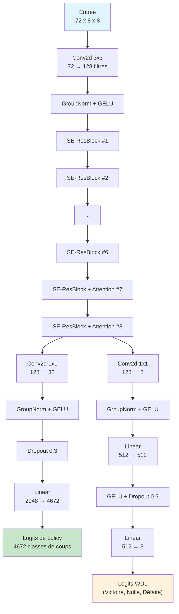
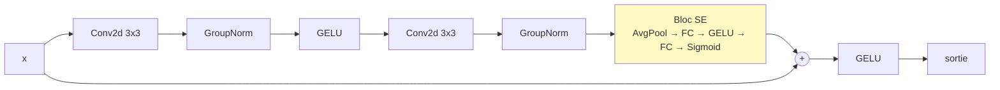
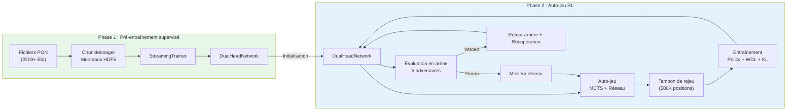
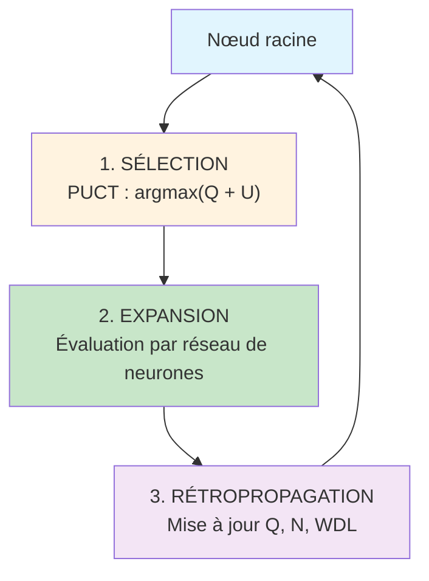
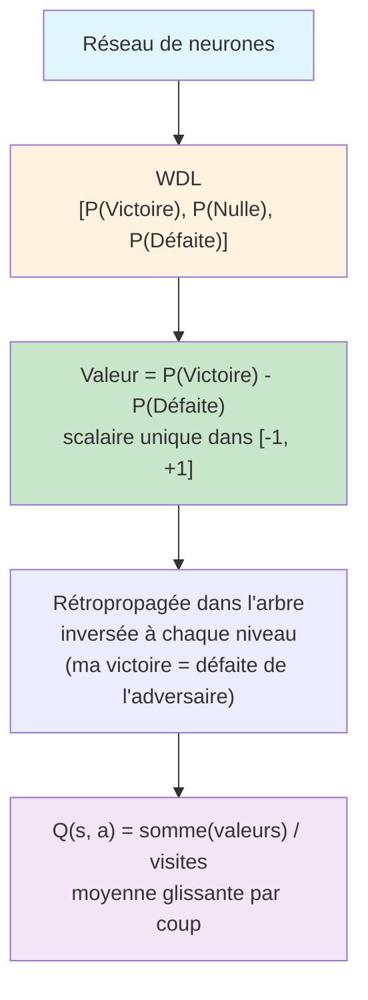
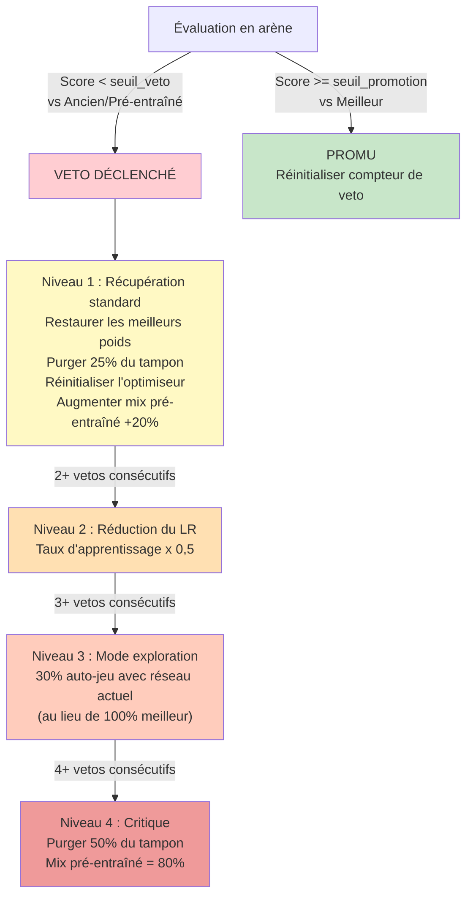

<div align="center">

# NeuralMatePlay

**Un moteur d'échecs par apprentissage par renforcement en deux phases**

[](https://python.org)
[](https://pytorch.org)
[](LICENSE)
[](https://github.com/psf/black)

_Combinant un pré-entraînement supervisé sur des parties de niveau maître avec un apprentissage par renforcement de type AlphaZero par auto-jeu, utilisant une architecture SE-ResNet avec attention spatiale et estimation de valeur Victoire/Nulle/Défaite._

**Comment ça marche en bref** : Le moteur apprend d'abord les échecs en étudiant des milliers de parties jouées par des joueurs humains forts (pré-entraînement), puis s'améliore davantage en jouant des millions de parties contre lui-même (auto-jeu). Un réseau de neurones évalue les positions sur l'échiquier et un algorithme de recherche arborescente explore les coups possibles pour trouver le meilleur.

</div>

<div align="center">


*Interface de jeu montrant un échec et mat délivré par l'IA (Noirs) avec Qg4#, avec l'analyse MCTS, l'arbre de recherche, le graphe d'évaluation et l'historique des coups.*

</div>

---

## Résumé

> NeuralMatePlay est un moteur d'échecs construit sur un **paradigme d'entraînement en deux phases** : (1) **pré-entraînement supervisé** sur des parties de niveau maître -- le réseau de neurones apprend à imiter les joueurs humains forts en prédisant leurs coups et les résultats des parties -- et (2) **apprentissage par renforcement de type AlphaZero par auto-jeu** -- le moteur joue ensuite contre lui-même pour découvrir des stratégies qui dépassent les connaissances humaines. L'architecture emploie un **Squeeze-and-Excitation ResNet** (un réseau de neurones profond où chaque couche peut apprendre à se concentrer sur les caractéristiques les plus importantes), enrichi d'une **attention spatiale multi-tête** (permettant au réseau de "regarder" des parties distantes de l'échiquier simultanément, comme un fou menaçant une tour à travers l'échiquier). Le réseau produit à la fois une **policy** (une distribution de probabilités sur 4 672 coups possibles, indiquant au moteur quels coups semblent prometteurs) et un **triplet Victoire/Nulle/Défaite (WDL)** (trois probabilités estimant les chances de gagner, de faire nulle ou de perdre la position actuelle). Un système **anti-oubli** multi-niveaux avec escalade de veto garantit que le moteur n'"oublie" jamais ce qu'il a appris pendant le pré-entraînement en poursuivant son entraînement. Les positions sont encodées sous forme de **tenseurs à 72 plans** -- imaginez 72 grilles transparentes 8x8 empilées les unes sur les autres, chacune capturant une information différente sur la position : emplacements des pièces, historique des coups, schémas d'attaque et caractéristiques tactiques.

### Caractéristiques principales

- **SE-ResNet + Attention spatiale** -- un réseau de neurones profond qui apprend quelles caractéristiques comptent le plus (SE) et comment les différentes cases de l'échiquier sont liées entre elles (attention), utilisant la Group Normalization et les activations GELU pour un entraînement stable et fluide
- **Tête de valeur WDL** -- au lieu d'un seul score "comment est cette position ?", le réseau prédit trois probabilités distinctes : Victoire, Nulle et Défaite, lui donnant une bien meilleure compréhension des positions nulles (+100-150 Elo d'amélioration)
- **Encodage de l'échiquier à 72 plans** -- l'échiquier est représenté sous forme de 72 grilles superposées, incluant 4 positions d'historique (pour que le réseau puisse voir les coups récents), des caractéristiques sémantiques inspirées de NNUE (sécurité du roi, structure de pions) et des plans tactiques (clouages, pièces en prise)
- **MCTS en lot** -- Monte Carlo Tree Search, un algorithme de prospective qui simule des centaines de continuations de parties possibles pour trouver le meilleur coup, optimisé avec des pertes virtuelles (pour le parallélisme), des tables de transposition (évitant le travail redondant) et la réutilisation de l'arbre (conservant l'analyse entre les coups)
- **Escalade de veto à 4 niveaux** -- un système de sécurité progressif qui détecte et récupère de l'oubli catastrophique (quand le réseau "oublie" soudainement ce qu'il a appris et commence à jouer moins bien)
- **Régularisation par divergence KL adaptative** -- une contrainte mathématique qui empêche le réseau de trop s'éloigner de ses connaissances pré-entraînées, agissant comme un "mur souple" qui devient plus fort plus le réseau essaie de dévier
- **Précision mixte (FP16)** -- utilise des nombres en virgule flottante demi-précision sur GPU pour un entraînement et une inférence ~2x plus rapides avec une perte de précision minimale
- **Pré-entraînement en flux par morceaux HDF5** -- traite de grandes bases de parties PGN (potentiellement des millions de parties) en petits morceaux économes en mémoire plutôt que de tout charger en RAM d'un coup
- **Arène à 5 adversaires** -- après chaque quelques cycles d'entraînement, le moteur est testé contre 5 adversaires différents (du jeu aléatoire à sa propre meilleure version précédente) pour s'assurer qu'il s'améliore réellement, avec suivi du classement ELO

---

## Table des matières

- [Architecture](#architecture)
  - [Vue d'ensemble du réseau](#vue-densemble-du-réseau)
  - [SE-ResBlock](#se-resblock)
  - [Attention spatiale](#attention-spatiale)
  - [Tête WDL vs Valeur scalaire](#tête-wdl-vs-valeur-scalaire)
- [Encodage de l'échiquier (72 plans)](#encodage-de-léchiquier-72-plans)
- [Encodage des coups (4 672 classes)](#encodage-des-coups-4672-classes)
- [Pipeline d'entraînement](#pipeline-dentraînement)
  - [Phase 1 : Pré-entraînement supervisé](#phase-1--pré-entraînement-supervisé)
  - [Phase 2 : Auto-jeu RL](#phase-2--auto-jeu-rl)
  - [Fonctions de perte](#fonctions-de-perte)
- [Monte Carlo Tree Search](#monte-carlo-tree-search)
  - [Sélection PUCT](#sélection-puct)
  - [Fonctionnalités MCTS](#fonctionnalités-mcts)
  - [Améliorations tenant compte du WDL](#améliorations-tenant-compte-du-wdl)
- [Système anti-oubli](#système-anti-oubli)
  - [Escalade de veto](#escalade-de-veto)
  - [Mécanismes](#mécanismes)
- [Évaluation par arène](#évaluation-par-arène)
- [Interface graphique](#interface-graphique)
  - [Interface de jeu](#interface-de-jeu)
  - [Moniteur d'entraînement](#moniteur-dentraînement)
  - [Visualiseur de matchs](#visualiseur-de-matchs)
- [Démarrage rapide](#démarrage-rapide)
  - [Prérequis](#prérequis)
  - [Installation](#installation)
  - [Premiers pas](#premiers-pas)
- [Configuration](#configuration)
- [Structure du projet](#structure-du-projet)
- [Citation](#citation)
- [Remerciements](#remerciements)

---

## Architecture

### Vue d'ensemble du réseau

Le réseau de neurones est le "cerveau" du moteur d'échecs. Pour toute position d'échecs donnée, il produit deux sorties : (1) une **policy** -- un classement de tous les coups possibles du meilleur au pire et (2) une **évaluation WDL** -- la probabilité que la position mène à une victoire, une nulle ou une défaite.

Le `DualHeadNetwork` utilise un **backbone SE-ResNet** (un empilement de couches de traitement qui extraient progressivement des motifs échiquéens de plus haut niveau, de la détection basique des pièces jusqu'aux concepts stratégiques complexes) avec de l'**attention spatiale** dans les blocs finaux (permettant au réseau de relier des cases distantes, par exemple comprendre qu'un fou en b2 menace une tour en g7). Le réseau se divise en deux "têtes" à la fin : une pour la sélection des coups (policy) et une pour l'évaluation de la position (WDL).



| Paramètre             | Valeur                              |
| --------------------- | ----------------------------------- |
| Plans d'entrée        | 72                                  |
| Filtres du backbone   | 128                                 |
| Blocs résiduels       | 8 (6 SE simples + 2 avec attention) |
| Ratio de réduction SE | 8                                   |
| Têtes d'attention     | 4                                   |
| Sortie policy         | 4 672 classes                       |
| Sortie WDL            | 3 (Victoire, Nulle, Défaite)        |
| Normalisation         | GroupNorm (8 groupes)               |
| Activation            | GELU                                |
| Paramètres            | ~3,5M                               |

### SE-ResBlock

Chaque couche du réseau est un **Squeeze-and-Excitation Residual Block** (SE-ResBlock). La partie "résiduelle" signifie que chaque bloc ajoute sa sortie à son entrée (une connexion de raccourci qui facilite l'entraînement de réseaux profonds). La partie "SE" permet à chaque bloc de décider dynamiquement quelles caractéristiques sont les plus importantes pour la position actuelle -- par exemple, en fin de partie, les caractéristiques d'activité du roi peuvent être amplifiées tandis que les caractéristiques spécifiques à l'ouverture sont atténuées :



Le bloc SE effectue une **attention par canal** (chaque "canal" représente une caractéristique apprise différente, comme "structure de pions" ou "sécurité du roi") :

1. **Squeeze (compression)** : Résumer chaque caractéristique en un seul nombre en moyennant sur les 64 cases
2. **Excite (excitation)** : Passer à travers deux petites couches qui produisent un score d'importance (0 à 1) pour chaque caractéristique
3. **Scale (mise à l'échelle)** : Multiplier chaque caractéristique par son score d'importance -- les caractéristiques utiles sont amplifiées, les non pertinentes sont atténuées

### Attention spatiale

Les 2 derniers blocs résiduels ajoutent de l'**attention spatiale multi-tête** (4 têtes). Alors que les convolutions ne regardent que les cases voisines (une fenêtre 3x3), l'attention permet à chaque case de "communiquer" directement avec toutes les autres cases de l'échiquier. C'est crucial pour comprendre les motifs à longue portée comme les lignes de clouage, les alignements de batteries (tour derrière la dame) ou l'influence diagonale d'un fou sur tout l'échiquier.

Le mécanisme fonctionne en 3 étapes :

- **Projection Query/Key/Value** : Chaque case génère trois vecteurs -- une Query ("je cherche quoi ?"), une Key ("je contiens quoi ?") et une Value ("je porte quelle information ?")
- **Scores d'attention** : La Query de chaque case est comparée aux Keys de toutes les autres cases pour déterminer quelles cases sont les plus pertinentes (par exemple: une case roi portant attention aux cases qui l'attaquent)
- **Agrégation** : Les informations des cases pertinentes sont combinées, pondérées par les scores d'attention et ajoutées aux caractéristiques originales via une connexion résiduelle

### Tête WDL vs Valeur scalaire

La plupart des moteurs d'échecs utilisent un seul nombre pour évaluer une position (par exemple: +0,5 signifie "légèrement meilleur pour les Blancs"). NeuralMatePlay prédit plutôt trois probabilités : **Victoire, Nulle et Défaite**. C'est particulièrement important aux échecs où beaucoup de positions sont nulles -- une valeur scalaire de 0,0 pourrait signifier soit "parfaitement équilibré, probablement nulle" soit "position sauvage, ça peut aller dans les deux sens", mais le WDL distingue clairement ces cas.

| Propriété          | Tête WDL                          | Tête valeur scalaire               |
| ------------------ | --------------------------------- | ---------------------------------- |
| Sortie             | P(Victoire), P(Nulle), P(Défaite) | Valeur unique dans [-1, 1]         |
| Fonction de perte  | Cross-entropy (3 classes)         | MSE                                |
| Gestion des nulles | Probabilité de nulle explicite    | Les nulles s'effondrent à 0        |
| Calibration        | Bien calibrée par résultat        | Mauvaise pour les positions nulles |
| Valeur MCTS        | `V = P(Victoire) - P(Défaite)`    | Sortie directe                     |
| Gain de force      | +100-150 Elo                      | Ligne de base                      |

---

## Encodage de l'échiquier (72 plans)

Avant que le réseau de neurones puisse analyser une position d'échecs, l'échiquier doit être converti en nombres -- le réseau ne peut pas "voir" les pièces directement. L'encodage fonctionne comme l'empilement de 72 grilles transparentes 8x8 les unes sur les autres. Chaque grille (appelée un **plan**) contient des 1 et des 0 représentant une information spécifique : "y a-t-il un pion blanc sur cette case ?", "cette case est-elle attaquée ?", "cette pièce est-elle clouée ?", etc.

Chaque position est encodée sous forme d'un **tenseur** (un tableau multidimensionnel) de forme `(72, 8, 8)` -- 72 plans de grilles 8x8 -- du point de vue du joueur au trait (l'échiquier est retourné pour les Noirs, de sorte que le réseau se "voit" toujours jouer depuis le bas).

**Formule** : `(H + 1) x 12 + 12 + 8 + 4 = 72` où `H = 3` (longueur d'historique)

| Plans | Catégorie                  | Description                                         |
| ----- | -------------------------- | --------------------------------------------------- |
| 0-11  | Positions des pièces (T)   | Position actuelle : 6 types de pièces x 2 couleurs  |
| 12-23 | Positions des pièces (T-1) | Il y a un coup                                      |
| 24-35 | Positions des pièces (T-2) | Il y a deux coups                                   |
| 36-47 | Positions des pièces (T-3) | Il y a trois coups                                  |
| 48    | Métadonnées                | Camp au trait (constante 1,0 depuis la perspective) |
| 49    | Métadonnées                | Nombre de coups complets (normalisé /200)           |
| 50-53 | Métadonnées                | Droits de roque (mon R, ma D, R adverse, D adverse) |
| 54    | Métadonnées                | Case de prise en passant                            |
| 55    | Métadonnées                | Compteur de demi-coups (normalisé /100)             |
| 56    | Métadonnées                | Nombre de répétitions (0,5 si 1x, 1,0 si 2x+)       |
| 57    | Métadonnées                | Est en échec                                        |
| 58    | Métadonnées                | Carte d'attaque alliée                              |
| 59    | Métadonnées                | Carte d'attaque adverse                             |
| 60    | Sémantique (NNUE)          | Attaquants du roi                                   |
| 61    | Sémantique (NNUE)          | Défenseurs du roi                                   |
| 62    | Sémantique (NNUE)          | Mobilité des cavaliers                              |
| 63    | Sémantique (NNUE)          | Mobilité des fous                                   |
| 64    | Sémantique (NNUE)          | Pions passés                                        |
| 65    | Sémantique (NNUE)          | Pions isolés                                        |
| 66    | Sémantique (NNUE)          | Cases faibles                                       |
| 67    | Sémantique (NNUE)          | Contrôle du centre                                  |
| 68    | Tactique                   | Pièces clouées                                      |
| 69    | Tactique                   | Pièces en prise (non défendues + attaquées)         |
| 70    | Tactique                   | Pièces attaquantes (ciblant une valeur supérieure)  |
| 71    | Tactique                   | Pièces piégées (mobilité < 2)                       |

---

## Encodage des coups (4 672 classes)

La tête policy du réseau produit une probabilité pour chaque coup possible. Comme les échecs ont un nombre variable de coups légaux par position (typiquement 30-40, mais l'encodage doit couvrir toutes les possibilités), les coups sont encodés à l'aide d'un **schéma centré sur la case de départ** de taille fixe : pour chacune des 64 cases, on définit 73 "types de coups" possibles (directions et distances qu'une pièce pourrait emprunter depuis cette case).

**Formule** : `64 cases x 73 types de coups = 4 672`

| Type de coup       | Nombre | Description                                                                                             |
| ------------------ | ------ | ------------------------------------------------------------------------------------------------------- |
| Coups de type dame | 56     | 8 directions x 7 distances (couvre les coups de tour, fou, dame, pion, roi)                             |
| Coups de cavalier  | 8      | Les 8 coups en L                                                                                        |
| Sous-promotions    | 9      | 3 types de pièces (cavalier, fou, tour) x 3 directions (capture à gauche, tout droit, capture à droite) |
| **Total**          | **73** | Par case de départ                                                                                      |

Les promotions en dame sont encodées comme des coups réguliers de direction dame. L'encodage est symétrique : pour les Noirs, les coups sont reflétés verticalement avant l'encodage.

---

## Pipeline d'entraînement

L'entraînement se déroule en deux phases. En **Phase 1**, le réseau apprend à partir de parties de joueurs experts humains -- comme un étudiant qui étudie des parties de grands maîtres pour comprendre les principes échiquéens. En **Phase 2**, le réseau joue contre lui-même (auto-jeu) et apprend de sa propre expérience -- comme un joueur qui, après avoir étudié la théorie, s'améliore en jouant des milliers de parties d'entraînement et en analysant ses erreurs.



### Phase 1 : Pré-entraînement supervisé

Dans cette phase, le réseau apprend par imitation : étant donné une position issue d'une partie forte, il essaie de prédire le coup joué par l'expert et le résultat final de la partie. Sur des millions d'exemples, le réseau apprend les valeurs des pièces, les schémas tactiques courants et les concepts positionnels.

- Traite des **fichiers PGN** (le format standard pour les parties d'échecs enregistrées) de parties classées **2200+ Elo** (niveau expert et au-dessus)
- Traite les positions en flux via des **morceaux HDF5** pour l'efficacité mémoire -- le jeu de données peut contenir des millions de positions, bien trop pour tenir en RAM, donc elles sont traitées en petits lots depuis le disque
- Entraîne simultanément sur la **policy** (prédire le coup de l'expert) et le **WDL** (prédire qui a gagné la partie)
- Dispose d'un **tampon de rejeu tactique** qui rejoue les positions difficiles (captures, échecs, promotions) plus souvent, de sorte que le réseau passe plus de temps à apprendre des situations complexes
- Supporte la **distillation de connaissances** depuis un modèle professeur -- un réseau plus grand et plus fort peut guider l'entraînement d'un plus petit

### Phase 2 : Auto-jeu RL

Dans cette phase, le moteur joue contre lui-même pour découvrir de nouvelles stratégies. Chaque partie génère des données d'entraînement : pour chaque position, le moteur enregistre quels coups il a explorés et qui a finalement gagné. Le réseau s'entraîne ensuite sur ces données pour améliorer ses prédictions de coups et ses évaluations de positions.

- Génère des parties via l'**auto-jeu guidé par MCTS** (800 simulations par coup par défaut -- le moteur considère 800 continuations futures possibles avant de choisir chaque coup)
- **Sélection de coup basée sur la température** : en début de partie (`T=1.0` pour les 30 premiers coups), le moteur varie délibérément son jeu pour explorer différentes positions ; plus tard (`T=0.1`), il joue ses meilleurs coups
- S'entraîne sur des **données mixtes** : tampon d'auto-jeu + données pré-entraînées (ratio configurable) -- mélanger des parties d'experts empêche le réseau d'"oublier" les connaissances échiquéennes humaines
- **Évaluation en arène** toutes les 5 itérations contre 5 types d'adversaires -- des tests réguliers pour s'assurer que le moteur devient réellement plus fort
- **Promotion au rang de meilleur modèle** avec système de veto anti-oubli -- ne remplace la "meilleure version connue" que si la nouvelle version prouve qu'elle est plus forte, avec des garde-fous contre la régression

### Fonctions de perte

La **fonction de perte** mesure à quel point les prédictions du réseau sont fausses -- plus la perte est basse, plus le réseau est performant. L'entraînement fonctionne en ajustant itérativement les poids du réseau pour minimiser cette perte. La perte totale d'entraînement combine trois composantes :

```
L = L_policy + L_WDL + w_KL * L_KL
```

| Composante | Formule                              | Description                                                                                       |
| ---------- | ------------------------------------ | ------------------------------------------------------------------------------------------------- |
| `L_policy` | `CrossEntropy(pi_pred, pi_target)`   | À quel point les probabilités de coups prédites sont éloignées des coups cibles                   |
| `L_WDL`    | `CrossEntropy(wdl_pred, wdl_target)` | À quel point les probabilités Victoire/Nulle/Défaite prédites sont éloignées du résultat réel     |
| `L_KL`     | `KL(pi_current ‖ pi_pretrained)`     | À quel point la policy actuelle a dérivé par rapport à la policy pré-entraînée (prévient l'oubli) |

Le **poids KL** `w_KL` est adaptatif : quand le comportement du réseau est encore proche du modèle pré-entraîné (divergence KL sous la cible), la pénalité reste légère. Mais si le réseau commence à trop dévier, la pénalité augmente progressivement -- comme un élastique qui tire plus fort plus on l'étire :

```
w_KL = base                           si KL <= cible
w_KL = base * (1 + facteur * excès)   si KL > cible   (plafonné au max)
```

L'entraînement utilise la précision mixte (FP16) sur les GPU compatibles avec `torch.amp.autocast`.

---

## Monte Carlo Tree Search

**Monte Carlo Tree Search (MCTS)** est l'algorithme de "réflexion" du moteur. Au lieu d'évaluer chaque coup possible jusqu'à une profondeur fixe (comme les moteurs traditionnels), MCTS construit un **arbre de recherche** en explorant sélectivement les coups les plus prometteurs. Il exécute des centaines de simulations : chaque simulation parcourt l'arbre, atteint une position inexplorée, demande au réseau de neurones de l'évaluer et propage le résultat vers le haut. Après toutes les simulations, le coup qui a été le plus exploré est sélectionné comme meilleur coup.

### Sélection PUCT

À chaque nœud de l'arbre, MCTS doit décider quel coup explorer ensuite. Il utilise la **formule PUCT** (Polynomial Upper Confidence Trees), qui équilibre deux objectifs : l'**exploitation** (explorer les coups que le réseau pense être bons) et l'**exploration** (essayer des coups moins visités qui pourraient être étonnamment forts) :



**Formule de sélection :**

```
score(s, a) = Q(s, a) + U(s, a)

U(s, a) = c_puct * P(s, a) * sqrt(N(s)) / (1 + N(s, a))

select = argmax_a [ Q(s, a) + U(s, a) ]
```

Où :

- `Q(s, a)` = valeur moyenne issue de la rétropropagation -- l'évaluation moyenne de toutes les simulations passées par ce coup (à quel point le coup semble bon d'après ce que nous avons exploré jusqu'ici)
- `P(s, a)` = probabilité a priori du réseau policy -- l'estimation initiale du réseau sur la qualité de ce coup, avant toute recherche
- `N(s)` = nombre de visites du parent -- total de simulations exécutées depuis la position actuelle
- `N(s, a)` = nombre de visites de l'enfant -- combien de fois ce coup spécifique a été exploré
- `c_puct = 1.5` = constante d'exploration -- des valeurs plus élevées font explorer le moteur plus largement ; des valeurs plus basses le font se concentrer sur les coups les plus prometteurs

### Q-Value

La **Q-value** (valeur de Qualité) est la métrique centrale utilisée par MCTS pour évaluer la qualité d'un coup. Elle représente l'**évaluation moyenne** de toutes les simulations passées par un coup donné -- essentiellement, "d'après tout ce que nous avons exploré jusqu'ici, à quel point ce coup est-il prometteur ?"

**Comment la Q-value est calculée :**

1. Quand le réseau de neurones évalue une position, il produit des probabilités WDL : `[P(Victoire), P(Nulle), P(Défaite)]`
2. Celles-ci sont converties en une valeur scalaire unique : `V = P(Victoire) - P(Défaite)`, allant de -1 (défaite certaine) à +1 (victoire certaine). Une valeur de 0 signifie que la position est équilibrée (soit probablement nulle, soit également volatile)
3. Au fil des simulations MCTS, chaque nœud accumule les valeurs de toutes les simulations qui l'ont traversé
4. La Q-value est la **moyenne glissante** : `Q(s, a) = W(s, a) / N(s, a)` où `W` est la somme de toutes les valeurs rétropropagées et `N` est le nombre de visites



**Pourquoi la Q-value est importante :** Dans la formule PUCT, la Q-value est le terme d'**exploitation** -- elle attire la recherche vers les coups qui ont historiquement mené à de bons résultats. Un coup avec Q = +0,3 a mené en moyenne à des positions favorables, tandis que Q = -0,2 suggère que le coup tend à mener à des difficultés. L'interface affiche les Q-values pour chaque coup candidat, colorées en vert (positif, bon pour le moteur) ou en rouge (négatif, mauvais pour le moteur).

**Convention de signe :** Comme MCTS alterne entre les joueurs à chaque niveau de l'arbre, la valeur est **inversée** à chaque étape de rétropropagation -- une position bonne pour les Blancs (V = +0,5) est mauvaise pour les Noirs (V = -0,5). Cela garantit que les Q-values sont toujours du point de vue du joueur qui fait le coup.

### Fonctionnalités MCTS

| Fonctionnalité               | Description                                                                                                                                                                                                       |
| ---------------------------- | ----------------------------------------------------------------------------------------------------------------------------------------------------------------------------------------------------------------- |
| **Inférence en lot**         | Collecte plusieurs positions feuilles par itération et les évalue ensemble sur le GPU en un seul lot, plutôt qu'une à la fois (beaucoup plus rapide)                                                              |
| **Pertes virtuelles**        | Lors de l'exploration d'un chemin, le marque temporairement comme "perdant" pour que les recherches parallèles explorent des chemins différents, assurant une couverture large                                    |
| **Table de transposition**   | Si la même position peut être atteinte par différents ordres de coups (par exemple: 1.e4 d5 vs 1.d4 e5 2.e4 d5), le moteur réutilise l'analyse existante au lieu de ré-analyser                                       |
| **Cache d'évaluation**       | Stocke jusqu'à 50K évaluations du réseau de neurones pour qu'une position revisitée ne nécessite pas un autre appel coûteux au réseau                                                                             |
| **Réutilisation de l'arbre** | Après qu'un coup est joué, le moteur conserve la partie pertinente de l'arbre de recherche (le sous-arbre sous le coup joué) pour le tour suivant, lui donnant une longueur d'avance                              |
| **Bruit de Dirichlet**       | Ajoute du bruit aléatoire aux probabilités de coups du nœud racine pendant l'entraînement par auto-jeu, forçant le moteur à explorer occasionnellement des coups inhabituels et découvrir de nouvelles stratégies |
| **Réduction FPU**            | First Play Urgency : les coups qui n'ont pas encore été explorés sont supposés légèrement moins bons que la moyenne actuelle, empêchant le moteur de perdre du temps sur des coups clairement mauvais             |
| **Température**              | Contrôle le hasard dans la sélection des coups : `T=1.0` (diversifié, exploratoire) pour les 30 premiers coups de l'auto-jeu ; `T=0.1` (choisit presque toujours le meilleur coup) ensuite                        |
| **Détection de mat forcé**   | Utilise la recherche minimax dans l'arbre MCTS pour détecter les échecs et mats garantis jusqu'à 5 coups d'avance, assurant que le moteur ne rate jamais une combinaison gagnante                                 |
| **Filtrage des répétitions** | Détecte les coups qui mèneraient à une nulle par triple répétition et les évite quand le moteur est en position gagnante                                                                                          |

### Améliorations tenant compte du WDL

<details>
<summary>Cliquez pour développer les fonctionnalités MCTS tenant compte du WDL</summary>

Parce que le réseau produit des probabilités Victoire/Nulle/Défaite (pas juste une valeur unique), le MCTS peut prendre des décisions plus intelligentes sur le risque et la récompense :

| Fonctionnalité              | Description                                                                                                                                                                                                               |
| --------------------------- | ------------------------------------------------------------------------------------------------------------------------------------------------------------------------------------------------------------------------- |
| **Contempt dynamique**      | Quand le moteur gagne, il évite les coups qui mènent à des nulles -- mais quand il perd, il recherche activement les chances de nulle. La pénalité s'adapte à la marge de gain : `Q -= contempt * max(W-L, 0) * P(nulle)` |
| **Bonus d'incertitude**     | Dans les positions "tranchantes" (forte chance de gagner ET de perdre), le moteur explore plus agressivement, car ces positions sont volatiles et méritent d'être investiguées : `U *= 1 + weight * sqrt(W * L)`          |
| **FPU par nulle adjacente** | Quand un coup de nulle sûr est disponible, le moteur ne pénalise pas les alternatives inexplorées aussi sévèrement, leur donnant une chance équitable de prouver qu'elles pourraient être encore meilleures               |

Ces fonctionnalités sont désactivées par défaut (`contempt=0`, `uncertainty_weight=0`, `draw_sibling_fpu=False`) et peuvent être activées pour un jeu avancé.

</details>

---

## Système anti-oubli

Un problème bien connu en apprentissage par renforcement est l'**oubli catastrophique** : à mesure que le réseau s'entraîne sur de nouvelles données d'auto-jeu, il peut soudainement "oublier" les schémas qu'il a appris pendant le pré-entraînement et commencer à jouer beaucoup moins bien. Par exemple, il pourrait cesser de comprendre les principes de base des finales ou oublier comment se défendre contre des ouvertures courantes. NeuralMatePlay traite ce problème avec un système de sécurité multicouche.

### Escalade de veto

La boucle d'entraînement inclut un **système d'escalade de veto multi-niveaux**. Après chaque cycle d'entraînement, le moteur est testé contre ses versions précédentes. S'il performe moins bien qu'avant (sous un seuil de score), un **veto** est déclenché -- le moteur revient à sa dernière bonne version et prend des mesures correctives de plus en plus agressives si le problème persiste :



### Mécanismes

| Mécanisme                            | Description                                                                                                                                                                                            |
| ------------------------------------ | ------------------------------------------------------------------------------------------------------------------------------------------------------------------------------------------------------ |
| **Retour aux poids**                 | Restaure les paramètres du réseau à la dernière version reconnue comme bonne                                                                                                                           |
| **Purge du tampon**                  | Supprime les exemples d'entraînement récents générés par le modèle dégradé, car ils peuvent contenir de mauvais schémas                                                                                |
| **Réinitialisation de l'optimiseur** | Efface l'élan de l'optimiseur Adam (historique des gradients accumulés), qui peut pointer dans une mauvaise direction                                                                                  |
| **Renforcement du mix pré-entraîné** | Augmente temporairement la proportion de données de parties d'experts dans les lots d'entraînement, "rappelant" au réseau les principes fondamentaux des échecs                                        |
| **Réduction du LR**                  | Divise par deux le taux d'apprentissage après des vetos répétés (escalade N2) -- des pas d'apprentissage plus petits pour éviter de dépasser à nouveau                                                 |
| **Mode exploration**                 | Utilise le réseau actuel (potentiellement innovant mais instable) pour 30% des parties d'auto-jeu au lieu de 100% meilleur réseau (escalade N3), générant des données d'entraînement plus diversifiées |
| **KL adaptatif**                     | Augmente progressivement la pénalité pour s'écarter des connaissances pré-entraînées quand une dérive est détectée                                                                                     |
| **Surveillance KL**                  | Système d'alerte précoce : déclenche une alerte à KL > 0,15 et force un test en arène immédiat à KL > 0,30                                                                                             |

---

## Évaluation par arène

Pour savoir si le moteur s'améliore, il doit être testé. L'**arène** est un système de tournoi automatisé qui oppose le réseau actuel à 5 adversaires de force variable après chaque quelques itérations d'entraînement. Cela fournit une image claire du niveau de compétence du moteur et détecte les régressions tôt.

| Adversaire            | Objectif                                                                                                                      | Seuil                         |
| --------------------- | ----------------------------------------------------------------------------------------------------------------------------- | ----------------------------- |
| **Aléatoire**         | Test de bon sens -- tout réseau entraîné devrait écraser les coups aléatoires                                                 | Score > 95%                   |
| **MCTS pur**          | Force intermédiaire -- MCTS sans aucun réseau de neurones (utilise des rollouts aléatoires). Teste que le RN aide réellement  | Score > 70%                   |
| **Meilleur**          | Porte de promotion -- doit surpasser la version actuelle la meilleure pour la remplacer                                       | Score > 55%                   |
| **Ancien checkpoint** | Anti-oubli -- testé contre une version précédente sélectionnée aléatoirement (jalon ou récente) pour détecter les régressions | Score > 35% (veto en dessous) |
| **Pré-entraîné**      | Suivi du progrès -- ne doit pas performer moins bien que le modèle pré-entraîné original (le point de départ)                 | Score > 35% (veto en dessous) |

La promotion au rang de "meilleur modèle" nécessite de battre la version actuelle la meilleure. Un **veto** se déclenche si le score tombe sous le seuil contre les anciens modèles ou le modèle pré-entraîné, indiquant que le moteur est devenu moins bon à quelque chose qu'il savait auparavant. Le **ELO** (un système de classement d'échecs standard où plus haut = plus fort) est estimé avec un K-facteur = 32 pour suivre le progrès dans le temps.

---

## Interface graphique

NeuralMatePlay inclut une suite complète d'interfaces graphiques basées sur tkinter avec un design inspiré de chess.com pour jouer, entraîner et analyser des parties.

### Interface de jeu

L'application de jeu principale (`python -m src.play`) fournit :

| Composant                   | Description                                                                                                                    |
| --------------------------- | ------------------------------------------------------------------------------------------------------------------------------ |
| **Échiquier**               | Widget d'échiquier interactif avec glisser-déposer des pièces, mise en évidence des coups légaux et indicateur du dernier coup |
| **Barre d'évaluation**      | Barre d'évaluation verticale style chess.com montrant qui est en train de gagner (Blancs en haut, Noirs en bas)                |
| **Graphe d'évaluation**     | Graphe d'évaluation en temps réel suivant l'avantage positionnel au fil de la partie                                           |
| **Panneau MCTS**            | Affiche les meilleurs coups candidats avec nombre de visites, Q-values, probabilités WDL, priors et détection de mat forcé     |
| **Arbre de recherche**      | Vue arborescente interactive et repliable de la recherche MCTS avec Q-values colorées (vert/rouge)                             |
| **Liste des coups**         | Historique complet des coups avec navigation (cliquer pour aller à n'importe quelle position)                                  |
| **Affichage d'ouverture**   | Montre le nom de l'ouverture actuelle depuis la base de données ECO                                                            |
| **Info joueurs**            | Noms des joueurs, pendules et décompte de matériel                                                                             |
| **Indicateur de phase**     | Montre la phase actuelle de la partie (ouverture, milieu de partie, finale)                                                    |
| **Indicateur de réflexion** | Indicateur animé pendant que l'IA calcule                                                                                      |

**Modes de jeu** : Humain vs IA, Humain vs Humain, IA vs IA (spectateur)

**Fonctionnalités IA** : Simulations MCTS configurables, gestion dynamique du temps, retournement de l'échiquier, support d'annulation de coups, sélection de modèle via boîte de dialogue.

### Moniteur d'entraînement

L'application d'entraînement (`python -m src.alphazero.train --gui`) fournit un tableau de bord en direct pendant l'auto-jeu RL :

- Affichage en temps réel de l'échiquier des parties d'auto-jeu en cours
- Progression de l'entraînement : nombre d'itérations, statistiques d'auto-jeu (V/N/D), taille du tampon
- Suivi des pertes : perte policy, perte WDL, divergence KL par époque
- Affichage des résultats de l'arène avec scores par adversaire
- Contrôles pour démarrer, mettre en pause et annuler l'entraînement

### Visualiseur de matchs

L'application de match (`python -m src.ui.match_app`) permet de regarder deux réseaux jouer l'un contre l'autre :

- Statistiques MCTS côte à côte pour les deux joueurs
- Panneaux d'arbre de recherche doubles montrant l'analyse de chaque IA
- Graphe d'évaluation suivant les deux perspectives
- Journal de parties avec comptage V/N/D sur plusieurs parties
- Contrôles de pause/reprise et délai entre les coups

---

## Démarrage rapide

### Prérequis

| Dépendance   | Version   | Utilité                                            |
| ------------ | --------- | -------------------------------------------------- |
| Python       | >= 3.10   | Environnement d'exécution                          |
| PyTorch      | >= 2.0.0  | Entraînement et inférence du réseau de neurones    |
| NumPy        | >= 1.24.0 | Opérations sur les tableaux                        |
| python-chess | >= 1.9.0  | Logique d'échecs, génération de coups, analyse PGN |
| h5py         | >= 3.8.0  | Stockage de morceaux HDF5 pour le pré-entraînement |
| Pillow       | >= 10.0.0 | Traitement d'images pour l'interface               |
| tkinter      | (inclus)  | Framework d'interface graphique                    |

### Installation

```bash
git clone https://github.com/TheoEwzZer/NeuralMatePlay.git
cd NeuralMatePlay
pip install -r requirements.txt
```

### Premiers pas

**Jouer contre le moteur :**

```bash
python -m src.play
```

**Pré-entraîner sur des parties de maîtres :**

```bash
python -m src.pretraining.pretrain --pgn data/lichess_elite_2020-08.pgn --epochs 5
```

**Lancer l'entraînement par auto-jeu :**

```bash
python -m src.alphazero.train --iterations 100 --games 100
```

**Reprendre l'entraînement avec interface graphique en direct :**

```bash
python -m src.alphazero.train --resume-trained latest --gui
```

**Diagnostiquer la qualité du réseau :**

```bash
python diagnose_network.py models
python show_losses.py --type iteration
```

---

## Configuration

Tous les **hyperparamètres** (paramètres qui contrôlent comment le réseau s'entraîne et joue -- des choses comme la vitesse d'apprentissage, la profondeur de recherche et les tailles de tampon) sont centralisés dans `config/config.json` :

### Réseau

| Paramètre             | Défaut | Description                                               |
| --------------------- | ------ | --------------------------------------------------------- |
| `num_filters`         | 128    | Canaux dans les blocs résiduels                           |
| `num_residual_blocks` | 8      | Total de blocs résiduels (les 2 derniers ont l'attention) |
| `history_length`      | 3      | Positions passées encodées (fixe, donne 72 plans)         |

### Pré-entraînement

| Paramètre           | Défaut | Description                              |
| ------------------- | ------ | ---------------------------------------- |
| `batch_size`        | 640    | Taille de lot                            |
| `learning_rate`     | 5e-5   | Taux d'apprentissage initial             |
| `epochs`            | 5      | Époques d'entraînement                   |
| `min_elo`           | 2200   | Filtre de classement minimum des parties |
| `label_smoothing`   | 0,05   | Lissage des étiquettes policy            |
| `value_loss_weight` | 1,5    | Pondération de la perte WDL              |
| `chunk_size`        | 20000  | Positions par morceau HDF5               |

### Auto-jeu RL

| Paramètre             | Défaut | Description                                   |
| --------------------- | ------ | --------------------------------------------- |
| `num_simulations`     | 800    | Simulations MCTS par coup                     |
| `games_per_iteration` | 100    | Parties d'auto-jeu par itération              |
| `batch_size`          | 1024   | Taille de lot d'entraînement                  |
| `learning_rate`       | 5e-6   | Taux d'apprentissage initial                  |
| `buffer_size`         | 500000 | Capacité du tampon de rejeu                   |
| `arena_interval`      | 5      | Itérations entre évaluations en arène         |
| `arena_games`         | 20     | Parties par match d'arène                     |
| `veto_threshold`      | 0,75   | Score pour éviter le veto anti-oubli          |
| `pretrain_mix_ratio`  | 0,5    | Ratio de données pré-entraînées dans les lots |
| `kl_loss_weight`      | 0,1    | Pénalité de base de divergence KL             |
| `c_puct`              | 1,5    | Constante d'exploration MCTS                  |
| `temperature_moves`   | 30     | Coups avec température exploratoire           |

---

## Structure du projet

```
NeuralMatePlay/
├── config/
│   └── config.json              # Tous les hyperparamètres
├── src/
│   ├── alphazero/
│   │   ├── network.py           # DualHeadNetwork (SE-ResNet + Attention + WDL)
│   │   ├── mcts.py              # MCTS avec inférence en lot & WDL
│   │   ├── trainer.py           # AlphaZeroTrainer (boucle d'auto-jeu)
│   │   ├── arena.py             # Évaluation en arène (5 adversaires)
│   │   ├── train.py             # Point d'entrée CLI pour l'entraînement
│   │   ├── spatial_encoding.py  # Encodage de l'échiquier en 72 plans
│   │   ├── move_encoding.py     # Encodage des coups en 4672 classes
│   │   ├── replay_buffer.py     # Tampon de rejeu d'expérience
│   │   ├── checkpoint_manager.py # Sauvegarde/chargement/nettoyage des checkpoints
│   │   └── device.py            # Gestion des périphériques GPU/CPU
│   ├── pretraining/
│   │   ├── pretrain.py          # Point d'entrée CLI pour le pré-entraînement
│   │   ├── streaming_trainer.py # Entraînement HDF5 économe en mémoire
│   │   ├── chunk_manager.py     # Création & gestion des morceaux HDF5
│   │   ├── pgn_processor.py     # Analyse PGN & extraction de positions
│   │   ├── dataset.py           # Wrappers de dataset PyTorch
│   │   └── tactical_weighting.py # Pondération des positions tactiques
│   ├── chess_encoding/
│   │   └── board_utils.py       # Fonctions utilitaires de l'échiquier
│   ├── ui/
│   │   ├── app.py               # Interface de jeu principale
│   │   ├── training_app.py      # Interface du moniteur d'entraînement
│   │   ├── board_widget.py      # Widget d'échiquier
│   │   └── components/          # Composants d'interface
│   ├── play.py                  # Jouer contre le moteur
│   ├── config.py                # Chargeur de configuration
│   └── init_network.py          # Helpers d'initialisation du réseau
├── data/                        # Fichiers PGN & morceaux HDF5
├── models/                      # Checkpoints du modèle pré-entraîné
├── checkpoints/                 # Checkpoints d'entraînement RL
├── requirements.txt
├── Makefile
└── README.md
```

---

## Citation

```bibtex
@software{neuralmateplay,
  title   = {NeuralMatePlay: A Two-Phase RL Chess Engine},
  author  = {Théo EwzZer},
  year    = {2026},
  url     = {https://github.com/TheoEwzZer/NeuralMatePlay},
  note    = {SE-ResNet with spatial attention, WDL value head and
             AlphaZero-style self-play with anti-forgetting mechanisms}
}
```

---

## Remerciements

Ce projet s'appuie sur des idées et techniques provenant de :

- **[DeepMind AlphaZero](https://arxiv.org/abs/1712.01815)** -- Le cadre fondateur pour l'auto-jeu MCTS neuronal
- **[Leela Chess Zero (lc0)](https://lczero.org/)** -- Conception de la tête de valeur WDL et enseignements pratiques d'implémentation
- **[Squeeze-and-Excitation Networks](https://arxiv.org/abs/1709.01507)** -- Mécanisme d'attention par canal (Hu et al., 2018)
- **[python-chess](https://python-chess.readthedocs.io/)** -- Bibliothèque de logique d'échecs et de génération de coups
- **[NNUE](https://www.chessprogramming.org/NNUE)** -- Inspiration pour les plans de caractéristiques sémantiques (sécurité du roi, mobilité, structure de pions)

---

<div align="center">

_Construit avec PyTorch et python-chess_

</div>
